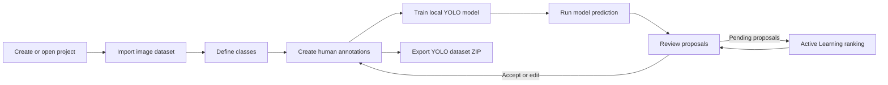
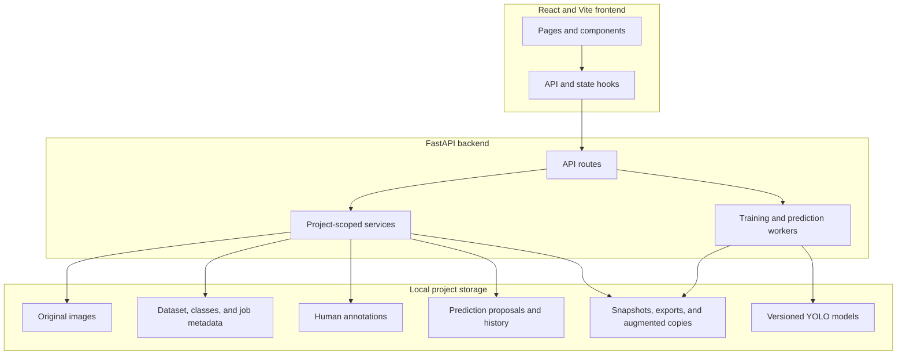
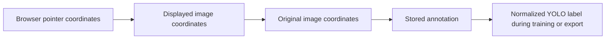
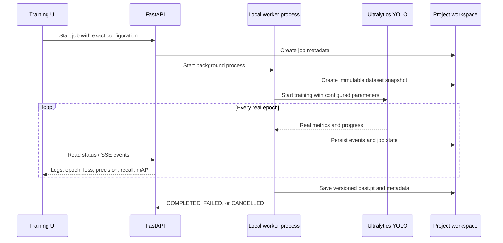

# Annotix

Annotix is an open-source, local-first computer-vision annotation and active-learning platform. It combines a React/Vite desktop-oriented interface with a FastAPI backend and local Ultralytics YOLO execution.

Everything runs on your own computer. Images, annotations, prediction proposals, generated exports, logs, and trained models stay in project-local folders. Annotix does not require AWS or a remote training server.

> Annotix is a generic object-detection platform. It is not tied to a particular document type, industry, or dataset.

## What Annotix can do

| Area | Current capabilities |
| --- | --- |
| Projects | Create, rename, switch, and delete independent local projects. Project data is isolated by a stable project ID. |
| Dataset | Import image-only datasets from a ZIP file or folder upload, preserve original resolution, generate thumbnails, handle duplicate filenames, and assign stable image IDs. |
| Classes | Add, rename, recolor, and delete classes. Immutable numeric class IDs remain stable for annotations, training, and export. |
| Annotation | Draw boxes by dragging or using two points, select/move/resize/delete boxes, assign classes, navigate images, and save original-image pixel coordinates. |
| Auto-save | Debounced annotation saving with Saved, Unsaved, Saving, Failed, and Retry states. Pending saves are protected during image navigation. |
| Training | Run real local Ultralytics YOLO training in a background process using annotated images, deterministic splits, configurable epochs, live logs, progress, loss/mAP metrics, cancellation, and versioned models. |
| Augmentation | Preview geometric and appearance transforms, use manual or random operations, train with on-the-fly augmentation, or save generated copies separately. Originals are never changed. |
| Prediction | Run a completed local model on the current image or unannotated images with configurable confidence and backend-enforced maximum detections. |
| Review | Keep dashed model proposals separate from solid human annotations; edit, accept, reject, bulk-review, filter, sort, and retain prediction history. |
| Active Learning | Rank eligible pending predictions by confidence uncertainty and open selected items in the existing Review workflow. |
| Export | Validate and generate an immutable, project-local YOLO dataset ZIP with train/validation images, labels, and `data.yaml`. |

## Application workflow



The backend remains the source of truth throughout this flow. The frontend displays and edits state through the API; it does not maintain a separate dataset database.

## Architecture



Frontend and backend are independent applications:

```text
Annotix/
|-- frontend/             # React + Vite application
|-- backend/              # FastAPI API, services, schemas, and workers
|-- data/                 # Local project workspaces (ignored by Git)
|-- models/               # Reserved global model storage (ignored by Git)
|-- .gitignore
`-- README.md
```

## Requirements

- Python 3.10 or newer
- Node.js 20 or newer with npm
- Enough local disk space for datasets, generated training snapshots, exports, and model checkpoints
- A CUDA-compatible PyTorch setup is optional; CPU training is supported but slower

No cloud account is required.

## Install and run on Windows PowerShell

Clone the repository:

```powershell
git clone https://github.com/girijageddavalasa/Annotix.git
cd Annotix
```

### 1. Start the backend

Open a PowerShell terminal in the repository root:

```powershell
cd backend
python -m venv .venv
Set-ExecutionPolicy -Scope Process -ExecutionPolicy Bypass
.\.venv\Scripts\Activate.ps1
python -m pip install --upgrade pip
python -m pip install -r requirements.txt
python -m uvicorn main:app --reload --host 127.0.0.1 --port 8000
```

Keep this terminal running. Verify the backend at:

- Health: <http://127.0.0.1:8000/api/health>
- Interactive API documentation: <http://127.0.0.1:8000/docs>

Expected health response:

```json
{
  "status": "ok",
  "service": "Annotix backend"
}
```

### 2. Start the frontend

Open a second PowerShell terminal in the repository root:

```powershell
cd frontend
npm install
npm run dev
```

Open <http://127.0.0.1:5173> (or the URL printed by Vite).

You activate the Python virtual environment only in backend terminals. The frontend uses Node/npm and does not use the Python environment.

## First-use guide

1. Use the project menu in the header to create a project.
2. Open **Dataset** and import an image ZIP or choose a folder.
3. Open **Classes** and add the object categories you need.
4. Open **Annotation**, choose a class, and draw bounding boxes.
5. Wait for the save indicator to return to **Saved**, or use the manual Save button.
6. Open **Training**, select epochs and other settings, then start local YOLO training.
7. After training completes, select the saved model in **Annotation** and run prediction.
8. Edit/accept/reject dashed proposals in **Annotation** or **Review**.
9. Use **Active Learning** in Review to prioritize uncertain pending results.
10. Open **Export** to validate and download a YOLO-format ZIP.

## Coordinate and annotation model

Annotations are stored in original-image pixel coordinates, not browser or resized-preview coordinates.



For example, an original `1920 x 1080` image displayed at `960 x 540` has a scale of two. A displayed box from `(100, 100)` to `(400, 300)` is stored approximately as `(200, 200)` to `(800, 600)`.

Each image can have different dimensions and orientation. Annotix preserves source resolution and never modifies original image files.

Conceptually, dataset records remain model-independent:

```text
image
|-- stable ID
|-- filename
|-- original dimensions
`-- annotations
```

YOLO conversion happens only when preparing training data or an export. The Dataset page is not coupled to YOLO.

## Stable identity and data safety

- Image IDs do not change when the gallery is filtered, sorted, or refreshed.
- Annotation records reference stable image IDs and immutable class IDs.
- Duplicate filenames are imported safely instead of overwriting an existing image.
- Original files remain separate from generated, augmented, training, and export artifacts.
- Imports do not delete or overwrite images already in the project.
- Projects cannot access another project's dataset, annotations, predictions, models, reviews, or exports.
- Large image content is served by backend URLs; it is not stored as huge React state payloads.

## Local storage layout

Each project is stored under `data/projects/<project_id>/`:

```text
data/projects/<project_id>/
|-- images/                    # Immutable imported originals
|-- thumbnails/                # Generated gallery thumbnails
|-- annotations/               # Human annotation JSON files
|-- predictions/               # Model proposals and review history
|-- metadata/
|   |-- dataset.json
|   |-- classes.json
|   |-- training/
|   |-- training_history/
|   `-- active_learning/
|-- generated/
|   |-- training/              # Immutable training snapshots/workspaces
|   |-- augmented/             # Optional generated augmented copies
|   `-- exports/               # Unique export workspaces and ZIP files
|-- logs/                      # Structured worker event logs
`-- models/                    # Versioned project-local models
```

These runtime directories are ignored by Git so private datasets and generated models are not accidentally pushed.

## Training pipeline

Training uses only images containing at least one valid human annotation.



Key behavior:

- Epochs are editable from `1` to `500`; the exact integer is validated by FastAPI, passed to Ultralytics, and stored in job, snapshot, history, and model metadata.
- Annotated images are deterministically divided into disjoint 80% training and 20% validation splits using seed `42` by default.
- An image and all of its boxes always remain in the same split.
- A valid existing training snapshot can provide the deterministic split for later export.
- The worker converts original-coordinate boxes to normalized YOLO labels.
- Training runs in another local Python process, keeping FastAPI responsive.
- Live console entries and metrics come from the real worker and trainer; Annotix does not fabricate training output.
- Duplicate concurrent training jobs are prevented.
- Conflicting edits to the training project's images, annotations, and classes are locked while training is active.
- Cancellation and failures are persisted cleanly.

The default architecture is the bundled `yolo11n.yaml`, which avoids downloading pretrained weights. To use an already-downloaded local checkpoint or model definition, set this before starting FastAPI:

```powershell
$env:ANNOTIX_YOLO_MODEL = "C:\path\to\local\weights.pt"
```

Completed models are stored separately:

```text
data/projects/<project_id>/models/<model_id>/
|-- best.pt
|-- last.pt
|-- configuration.json
|-- class_mapping.json
|-- dataset.yaml
|-- training_run.json
`-- run/
```

A run is marked completed only after `best.pt` exists and Ultralytics can load it.

## Prediction, Review, and Active Learning

Prediction uses completed project-local models and real Ultralytics post-NMS output.

- Default confidence threshold: `0.25`
- Allowed confidence range: `0.05–0.95`
- Maximum detections per image: `25`, `50`, `100`, or `200` (default `100`)
- NMS is class-aware so detections of different classes are handled correctly
- Very low thresholds show a false-positive warning
- Proposals display as dashed boxes with class and confidence
- Human annotations remain visually distinct solid boxes
- Proposals are never automatically converted into annotations

Review actions are explicit:

- **Edit** changes a proposal's class or original-coordinate box.
- **Accept** creates a permanent human annotation matching the proposal's latest edited state.
- **Reject** retains history but creates no annotation.
- Repeated acceptance is idempotent and cannot create duplicate annotations.

Active Learning v1 ranks pending predictions deterministically using confidence uncertainty. For prediction confidence `p`, uncertainty is `1 - p`; image uncertainty is the mean uncertainty of its eligible predictions. Images without detections are listed separately and are not assigned a fabricated uncertainty score.

## YOLO export

Export is generated by the backend and never changes source images or human annotations.

Before generating an export, Annotix reports:

- Images and annotated images
- Object count and classes
- Training and validation image counts
- Missing image/class references
- Invalid or out-of-bounds boxes

Invalid annotations are reported instead of silently creating corrupted labels. Every export receives a unique export ID and workspace; existing exports are never overwritten.

ZIP structure:

```text
annotix-export.zip
|-- images/
|   |-- train/
|   `-- val/
|-- labels/
|   |-- train/
|   `-- val/
`-- data.yaml
```

`data.yaml` uses the project's immutable class IDs mapped into deterministic contiguous YOLO indices. Bounding boxes are normalized from the original image dimensions.

## Main API groups

All endpoints are below `/api`.

| Prefix | Purpose |
| --- | --- |
| `/health` | Backend availability |
| `/projects` | Project creation, activation, rename, deletion, and listing |
| `/dataset` | Dataset state, image serving, thumbnails, ZIP and folder imports |
| `/classes` | Stable class CRUD and usage validation |
| `/annotations` | Human annotation loading, saving, updating, and deletion |
| `/training` | Background jobs, status, real event streams, and cancellation |
| `/predictions` | Model listing, inference jobs, proposals, accept/reject actions |
| `/review` | Project review queue, grouped items, and bulk actions |
| `/active-learning` | Eligible sources, deterministic rankings, and review targets |
| `/exports` | Export validation preview, generation, and ZIP download |

Use <http://127.0.0.1:8000/docs> for the exact interactive endpoint schemas.

## Environment configuration

Backend settings use the `ANNOTIX_` prefix and can be placed in `backend/.env`. Machine-specific paths should not be committed.

Example:

```dotenv
ANNOTIX_CORS_ORIGINS=["http://localhost:5173","http://127.0.0.1:5173"]
```

Defaults keep datasets and model artifacts relative to the repository:

- `data/`
- `models/`

Ultralytics is placed in offline mode by the worker, and its local settings are stored under `data/.ultralytics/`.

## Development checks

Backend compilation:

```powershell
cd backend
.\.venv\Scripts\python.exe -m compileall -q .
```

Backend tests:

```powershell
cd backend
.\.venv\Scripts\python.exe -m pytest
```

Frontend checks:

```powershell
cd frontend
npm run lint
npm run build
```

## Troubleshooting

### `ModuleNotFoundError: No module named 'PIL'`

Activate the backend environment and install all requirements:

```powershell
cd backend
.\.venv\Scripts\Activate.ps1
python -m pip install -r requirements.txt
```

The pip package is named `Pillow`, while Python imports it as `PIL`.

### `Could not import module "main"`

Run Uvicorn from the `backend` directory:

```powershell
cd backend
python -m uvicorn main:app --reload --host 127.0.0.1 --port 8000
```

### Port already in use

Another backend or frontend process is already running. Stop it with `Ctrl+C` in its terminal before starting another server on the same port.

### Frontend reports `Failed to fetch`

Confirm FastAPI is running on `127.0.0.1:8000`, open `/api/health`, and verify the frontend URL is allowed by the backend CORS configuration.

### Training is slow

CPU training is supported but can take significant time. Select GPU only when the local PyTorch/Ultralytics installation can access a compatible CUDA device. Smaller image sizes and batches may reduce memory use.

## Privacy and generated files

The repository `.gitignore` excludes local datasets, generated models, logs, virtual environments, build output, and environment files. Always review `git status` before committing. Annotix is local-first, but users remain responsible for securing their own computer and dataset backups.

## License and contributions

Annotix is intended as an open-source project hosted at <https://github.com/girijageddavalasa/Annotix>. Issues and pull requests are welcome. Add a repository license file before distributing builds if one has not yet been selected.
